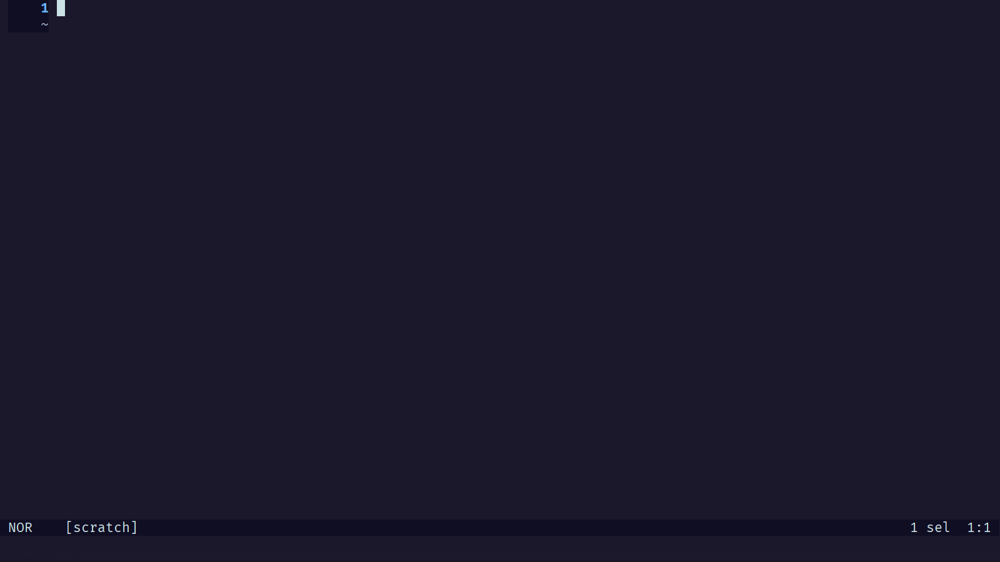

### [Challenger Deep Theme](https://challenger-deep-theme.github.io/) for [Helix](https://github.com/helix-editor/helix)

`NOTE: this theme is outdated, I currently don't have time to maintain or update it,
so if anyone is interested in maintaining it feel free to DM me`

### Installation
Drop the `challenger_deep.toml` file into your themes folder, it's located on the `runtime` folder,
the runtime folder is located on `~/.config/helix/runtime` on Linux and MacOS, and on `%AppData%/helix/runtime` on windows,
if it isn't there check your `HELIX_RUNTIME` env variable

### Screenshots

